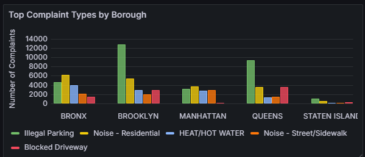
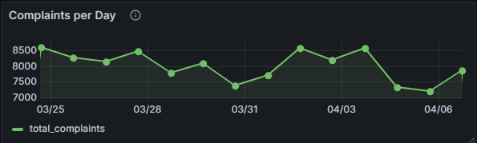
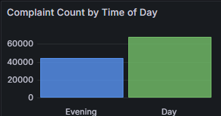
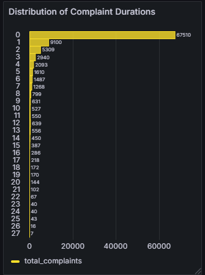
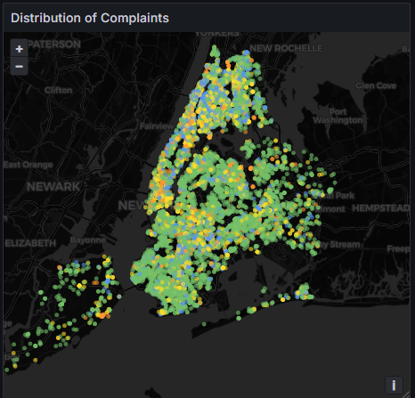

# NYC 311 AWS Serverless Pipeline + Grafana Dashboard Project

This project showcases an end-to-end data engineering pipeline that ingests, transforms, and visualizes New York City's 311 service request data using AWS services and Grafana.

The dataset includes approximately one week of 311 service requests across all five NYC boroughs. Each record contains metadata such as complaint type, agency, timestamps, geographic location, and status. The dataset was filtered to reduce record count for project scope and resource constraints.


---

### 🛠️ Project Architecture

**Source: [NYC 311 Open Data API](https://data.cityofnewyork.us/resource/erm2-nwe9.json)**

**Ingestion: AWS Lambda + Kinesis Firehose**

**Storage: Amazon S3 (raw + transformed)**

**Processing: AWS Glue (ETL pipeline + quality checks)**

**Query Engine: AWS Athena**

**Visualization: Grafana**


---

### :file_folder: Repository Structure

```
├── README.md
│
├── aws_glue_jobs/
│   ├── create_transformed_parquet_response_table.py
│   ├── delete_transformed_parquet_response_table.py
│   ├── data_quality_check_parquet_table.py
│   └── publish_prod_parquet_response_table.py
│
├── lambda/
│   └── nyc_311_response_ingestion.py
│
├── sql/
│   └── total_complaints_single_stat.sql
│
├── grafana/
│   ├── dashboard/
│   │   └── nyc_311_non_emergency_service_requests.json
│   └── screenshots/
│       ├── complaint_duration_histogram.png
│       ├── complaints_day_vs_night.png
│       ├── complaints_over_time.png
│       ├── map_complaints_by_type.png
│       ├── top_5_complaints_by_borough.png
│
```

---

### :rocket: Project Objectives

-Ingest 1 week of NYC 311 complaint data

-Clean, enrich, and transform the data using SQL (CTAS in Glue)

-Add calculated fields (e.g., day vs. night, duration, partition fields)

-Perform data quality checks (nulls, negative durations, excessive durations)

-Publish a production-ready Parquet dataset

-Visualize insights in Grafana with multiple chart types


---

### :label: Key Fields Added During Transformation

**-created_timestamp, closed_timestamp:** For incident duration length and time series graph

**-incident_duration_days:** A floating point field calculated using created/closed timestamps e.g. 3.1 days

**-time_of_day:** Day (6AM–5PM) or Evening (5PM-6AM)

**-day_type:** Weekday or Weekend

**-year, month, day:** for partitioning


---

### :gear: Glue Jobs

**create_nyc311_transformed_parquet.py:** CTAS job using Athena

**data_quality_check_parquet_table.py:** Counts nulls and other data issues e.g. negative incident durations

**delete_nyc311_parquet_table.py:** Clears output bucket and drops table for repeatability

**publish_prod_parquet_response_table.py:** Copies clean data into timestamped production path


---

### :bar_chart: Visualizations in Grafana

### Top 5 Complaint Types by Borough  


### Complaint Types by Volume  


### Complaint Volume Over Time  


### Day vs Night Complaint Distribution  


### Complaint Duration Histogram  


### Complaint Map by Type  


---

### :warning: Challenges Faced

**Athena SQL compatibility (e.g., casting ISO timestamps, using Unix time):**  Getting Athena SQL to play nicely was more difficult than expected—especially when it came to casting ISO timestamps and juggling Unix time conversions for calculating durations. Some of the syntax quirks caught me off guard and required a lot of testing.

**Glue job failures due to malformed CTAS or field types:**  Several Glue jobs failed early on due to issues with malformed CTAS queries and inconsistent field types. A lot of time was spent isolating the problem to the underlying schema or structure rather than the logic itself.

**Grafana limitations in field overrides and legend matching:**  Grafana presented its own frustrations, particularly around color mapping and legend accuracy. Matching series colors to field values without access to more dynamic override options required trial and error.

**AWS Glue query debugging and role permissions:**  Debugging Glue permissions and understanding exactly what roles were needed to run queries or drop tables in Athena was time-consuming. Even small misconfigurations could quietly break things, so I had to double back more than once to sort it out.

---

### :bulb: Next Steps / Enhancements

-Parameterize Glue jobs for date range or incremental ingestion

-Automate the workflow using Glue Triggers

---

### :mailbox: Contact

-Created by Matt Wood — for questions or collaborations, feel free to open an issue or reach out on GitHub.


